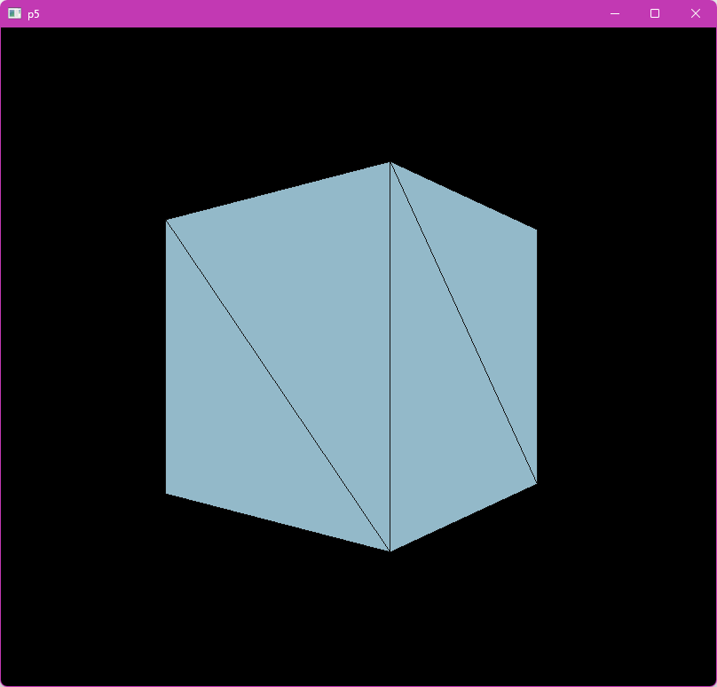
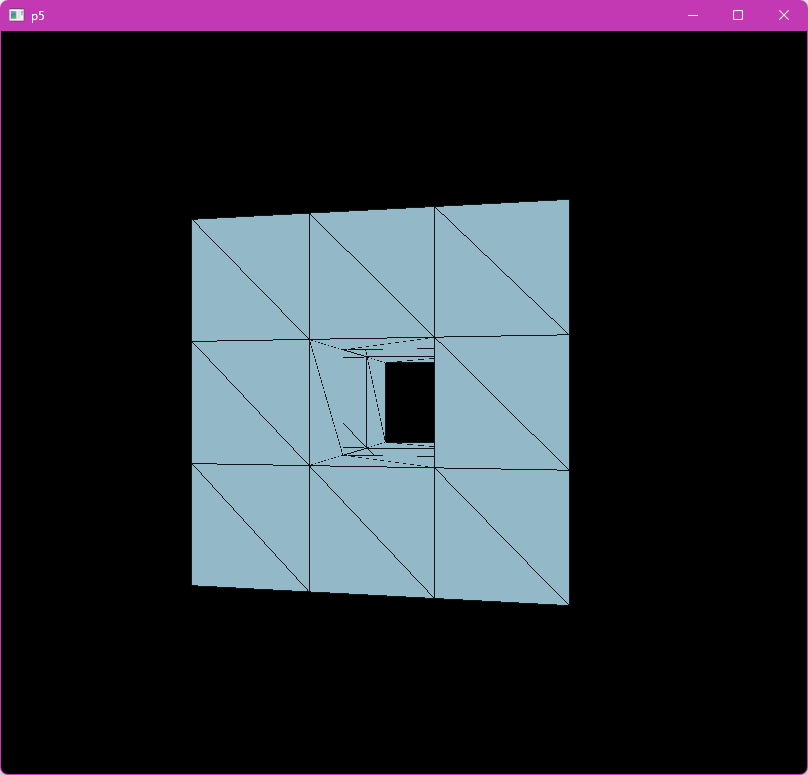

### メンガーのスポンジをPython用Procossingのモジュールp5で作成するコード（のフォーク）
#### ゆっくりと回転しているスポンジ、ただの立方体であるレベル0からスタートする。クリックするとレベルが上がる。
  

#### ただし、コードの中で、レベル2までに制限されている。実際のところレベル3にすると超絶処理が重くなり、一コマ生成するのに数分以上かかるため、事実上、使用不能。
#### 要するに、使えるのはレベル1、レベル2のみで、レベル3は使用不能。

#### pip install p5

### 作者によるYouTube動画がある。
### 以下、オリジナルのREADME.md
#

# Menger-sponge-with-python-p5
### sorry if it slow , p5 is really slow with python , enjoy
## check out my youtube channel: https://www.youtube.com/channel/UCjPk9YDheKst1FlAf_KSpyA

